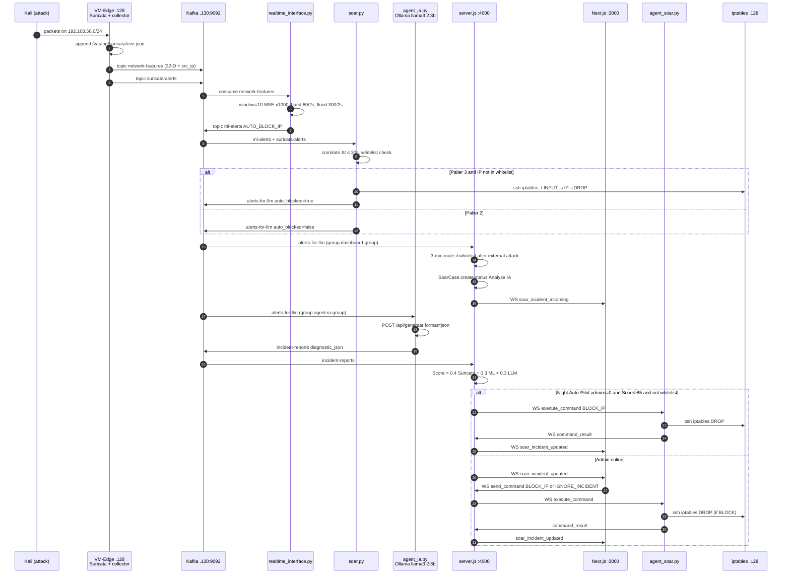
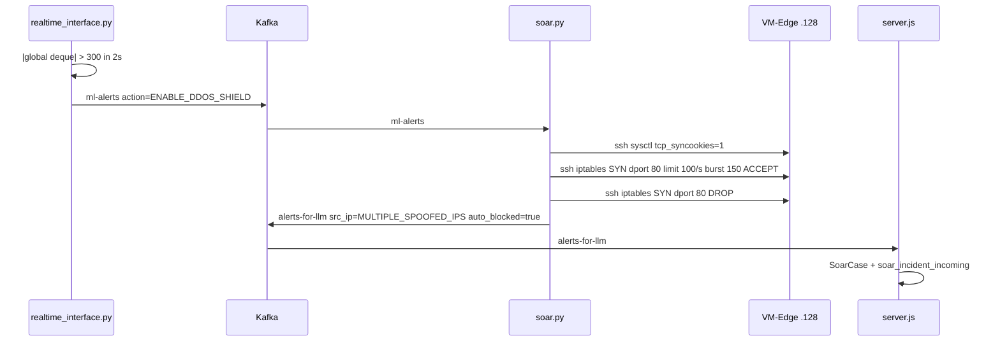
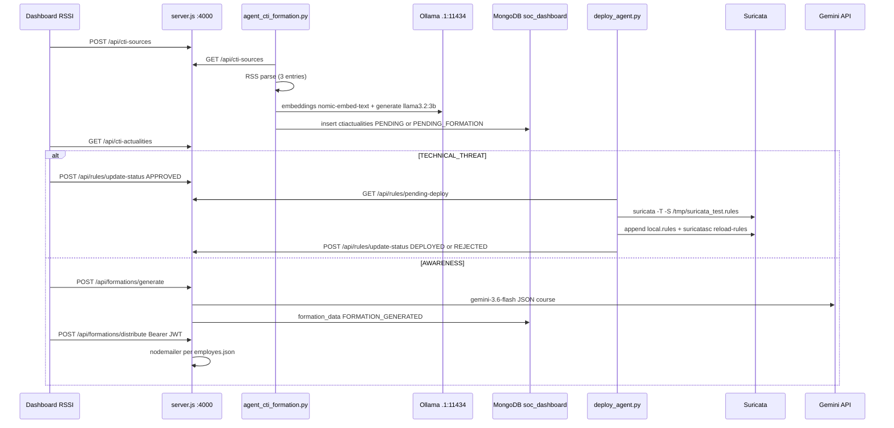
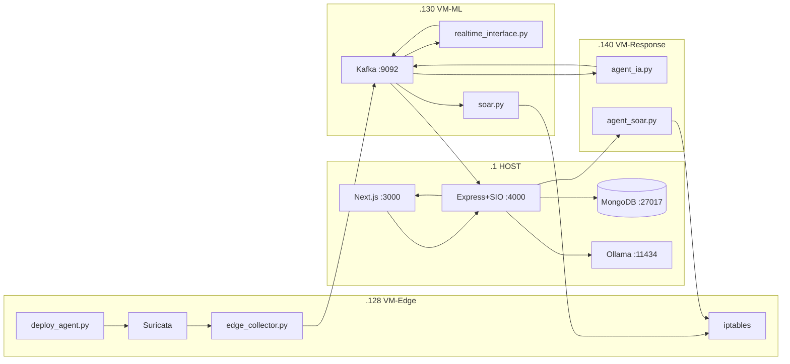

# 02 — Architecture and Data Flow

**Network:** VirtualBox Host-Only Ethernet adapter, IPv4 prefix **`192.168.56.0/24`**.  
**Control plane:** Node.js hub `192.168.56.1:4000`.  
**Streaming plane:** Apache Kafka `192.168.56.130:9092`.  
**Enforcement plane:** iptables on `192.168.56.128` via SSH (`aziz`, key `/home/aziz/.ssh/soar_key`).

---

## 1. Network topology and IP plan

### 1.1 Node table (authoritative)

Addresses below appear in `backend/actifs_critiques.json`, Socket.IO agent constants, Kafka bootstrap strings, and SSH targets. The Next.js infrastructure page **initially** paints `.10` / `.20` / `.30`; those values are placeholders and are replaced by `ipAddress` from MongoDB after `vm_metrics` upserts.

| Hostname (code) | IPv4 | Operating role | Principal processes / services |
|-----------------|------|----------------|--------------------------------|
| HOST (Windows physical) | **192.168.56.1** | Dashboard, SOC hub, MongoDB, Ollama (documented), Gemini client, SMTP | `frontend` Next.js **3000**; `backend/server.js` **4000**; `mongod` **27017**; `ollama serve` **11434** |
| VM-Capteur-Suricata | **192.168.56.128** | NIDS + firewall | Suricata, Filebeat, `edge_collector.py`, `deploy_agent.py`, `agent_monitor.py`, iptables |
| ML | **192.168.56.130** | Kafka broker, LSTM-VAE inference, automated SOAR | Kafka **9092**, Elasticsearch (watched), `realtime_interface.py`, `soar.py`, `agent_monitor.py` |
| VM-Response | **192.168.56.140** | Cognitive LLM + human SOAR actuator | `agent_ia.py`, `agent_soar.py`, CTI scripts, optional local Ollama |
| Kali Linux | Not hardcoded in Python/JS | Offensive traffic generator | Tools chosen by the operator; **no repository payloads** |

Whitelist (cannot be iptables-DROP’d by `soar.py` `bloquer_ip()`, and Auto-Pilot DROP is skipped in the hub):

```json
["192.168.56.128", "192.168.56.130", "192.168.56.140", "192.168.56.1"]
```

Kali and any other Host-Only guest (for example a simulated victim) are **not** in this list unless added via `POST /api/whitelist` or Settings UI.

### 1.2 Logical layers on the LAN

```text
                    192.168.56.0/24  (Host-Only)
    ┌──────────────────────────────────────────────────────────┐
    │  .1 HOST                                                 │
    │   Next.js :3000  ←CORS→  Express+Socket.IO :4000         │
    │   MongoDB :27017         Ollama :11434 (documented)      │
    │              │ KafkaJS consumer                          │
    │              │ REST CTI / rules / LMS                    │
    └──────┬───────┴───────────────┬───────────────────────────┘
           │ Socket.IO             │ HTTP 11434 / 4000
           │                       │
    .128 EDGE              .130 ML (Kafka :9092)           .140 RESPONSE
    Suricata/iptables      LSTM-VAE + soar.py              Llama + agent_soar
           │                       ▲
           └──── eve.json ─────────┘  producers: network-features,
                                      suricata-alerts
```

### 1.3 Trust boundaries

| Boundary | Mechanism |
|----------|-----------|
| Browser → hub REST | JWT `Authorization: Bearer` on a **subset** of routes (`verifySOCAdmin`); dashboard cookie `soc_token` for Next.js `proxy()` |
| Browser → hub WS | Origin check: `localhost:3000` or `192.168.56.1:3000` increments `activeAdmins` |
| VM agents → hub WS | Same Socket.IO server; not counted as admins |
| SOAR → edge | SSH with dedicated key; command strings built only after IPv4 regex match |
| Edge → Kafka | Unauthenticated Kafka on the lab LAN (no SASL in code) |
| CTI → Mongo | `mongodb://192.168.56.1:27017/` from VMs |
| Hub → Gmail | App password env `EMAIL_PASS` |

---

## 2. End-to-end data pipeline (packet lifecycle)

The following is the **live detection-to-mitigation** path. Offline training (CIC-IDS2017 CSVs) is documented in [03-ml-and-detection-engine.md](./03-ml-and-detection-engine.md) and is not on the critical path of a Kali packet.

### Stage A — Attack injection (VM-Kali)

An operator on Kali generates traffic toward a laboratory target (commonly a service on `.128` or another guest). Examples used conceptually in comments and simulations: SSH brute force, HTTP SYN flood, web attacks. The repository does not ship exploit commands. Traffic crosses the Host-Only switch and arrives on VM-Edge’s sniffing/filtering interface.

### Stage B — Suricata EVE logging (VM-Edge)

Suricata classifies the flow and/or matches a signature. It appends JSON lines to `/var/log/suricata/eve.json`.

`edge_collector.py` opens the file, `seek(0, 2)` (tail), and `yield`s each new line. `json.loads` failures increment `nb_ignores`.

- If `event_type == "flow"`: `extraire_features()` builds the 32-key dict (see document 03 for field-level mapping and zeros). Kafka `producer.send("network-features", features)` with `linger_ms=0`.
- If `event_type == "alert"`: `extraire_alerte()` sends `suricata-alerts` with `source: "suricata"`, `src_ip`, `signature`, `severity` (default 3), `category`, `timestamp` (Unix `time.time()`).

Bootstrap: `KAFKA_BOOTSTRAP_SERVERS = "192.168.56.130:9092"`.

### Stage C — Vector streaming and ML inference (VM-ML)

`realtime_interface.py` consumes `network-features`, group `realtime-interface`, `auto_offset_reset="latest"`.

For each message:

1. Record timestamp in `historique_global_paquets` (2-second sliding deque). If `len > 300` and 30 s since last global alert → produce `ml-alerts`:

```json
{
  "action": "ENABLE_DDOS_SHIELD",
  "source": "hybrid-global-burst-engine",
  "src_ip": "MULTIPLE_SPOOFED_IPS",
  "threatType": "DDoS Volumétrique par Usurpation d'IP (Spoofing)",
  "mse": 99.99,
  "seuil": "<loaded threshold>"
}
```

   Then **return** (LSTM is not invoked for that packet).

2. Else extract 32 floats; skip header-like rows; maintain `deque(maxlen=10)` per `src_ip`.
3. When the window is full: `scaler.transform` → clip \([0,1]\) → shape `(1, 10, 32)` → `inference_compilee` → MSE \(\times 1000\).
4. Burst: same IP ≥ 80 packets / 2 s.
5. After 3 consecutive “anomalous” windows: if IP not in whitelist, `executer_auto_block` produces `ml-alerts` with `"action": "AUTO_BLOCK_IP"` (cooldown 300 s).

### Stage D — SOAR correlation and first actuation (VM-ML `soar.py`)

Consumer topics: `ml-alerts`, `suricata-alerts`. Producer: `alerts-for-llm` (and `incident-reports` on Zero-Trust bypass).

- `ENABLE_DDOS_SHIELD` → SSH to `192.168.56.128`:
  - `sudo sysctl -w net.ipv4.tcp_syncookies=1`
  - `sudo iptables -I INPUT -p tcp --syn --dport 80 -m limit --limit 100/s --limit-burst 150 -j ACCEPT`
  - `sudo iptables -A INPUT -p tcp --syn --dport 80 -j DROP`  
  Then one `alerts-for-llm` message with `src_ip: "MULTIPLE_SPOOFED_IPS"`, `auto_blocked: true`.
- Whitelisted `src_ip` → no DROP; `incident-reports` emergency diagnostic; IP added to `ips_deja_bloquees` as a **logical** lock.
- Dual detection within **30 s** → `iptables -I INPUT -s {ip} -j DROP` then LLM notify `auto_blocked: true`.
- Single-source Palier 2 → LLM notify `auto_blocked: false` (Suricata path gated by 60 s category cache).

### Stage E — LLM report generation (VM-Response)

`agent_ia.py` consumes `alerts-for-llm`, group `agent-ia-group`. Builds the SOC Tier-3 prompt, `POST http://localhost:11434/api/generate` with `model: "llama3.2:3b"`, `format: "json"`, timeout 120 s. Publishes `incident-reports`:

```json
{
  "src_ip": "<ip>",
  "diagnostic_json": { "titre_incident": "...", "resume_executif": "...", "niveau_severite": "...", "score_confiance": 95, "mitre_attack_technique": "...", "analyse_technique": "...", "recommandations_actions": ["...", "..."] },
  "prompt_contexte": "<full prompt>",
  "timestamp": 0.0,
  "duree_generation_sec": 0.0
}
```

### Stage F — Hub persistence, fusion, WebSocket, Auto-Pilot (Host)

`server.js` `kafkaConsumer` group `dashboard-group`:

**On `alerts-for-llm`:**

1. If `payload.src_ip` **not** in whitelist → set `lastExternalAttackTime = Date.now()`.
2. If **in** whitelist **and** `(now - lastExternalAttackTime) < 180000` (3 minutes) → **return** (collateral MSE mute). Else treat as internal Zero-Trust alert.
3. `SoarCase.create` with placeholder summary `⏳ L'Agent IA (Llama 3) analyse...`, `aiConfidenceScore: 0`, status `Analyse IA (Auto-bloqué)` or `Analyse IA (Action requise)` depending on `auto_blocked`.
4. `io.emit('soar_incident_incoming', savedIncident)`.

**On `incident-reports`:**

1. Find latest `SoarCase` for that IP with `caseStatus` matching `/^Analyse IA/`.
2. Parse `diagnostic_json`; if empty, inject Bypass JSON (titre `Alerte Mouvement Latéral (Bypass IA)`, MITRE `T1021`, confidence 99).
3. `calculerScoreMenaceCompose` (document 03).
4. Status machine:
   - `activeAdmins === 0` ∧ score ≥ 85 ∧ not whitelist → `Bannie (Auto-Pilote / Mode Nuit)` and `io.emit('execute_command', { action: "BLOCK_IP", targetIp, sensor: "SOAR-Auto-Pilot", incidentId })`.
   - whitelist → `Alerte Zero Trust (Protégée)` (no DROP).
   - existing status contains `Auto-bloqué` → `Bannie (Auto-Remédiation)`.
   - else `Ouvert`.
5. If `activeAdmins > 0` → `soar_incident_updated`. Else SMTP HTML mail to the operator address configured in `server.js`.

### Stage G — Dashboard push (Host Next.js)

Clients connect with `io("http://" + window.location.hostname + ":4000")`.

| Event | UI effect |
|-------|-----------|
| `soar_incident_incoming` | Incidents list prepend; Sidebar count; NotificationCenter; GlobalAlertListener siren + overlay; overview `alert.mp3` / tab blink (overview also listens `new_incident`, which the hub **does not emit** — live path is `soar_incident_incoming`) |
| `soar_incident_updated` | Patch case status, diagnostic, score; IA Activity page |
| `dashboard_update` | Infrastructure CPU/RAM/services |
| `execute_command` | Not consumed by React; consumed by `agent_soar.py` |

### Stage H — SSH iptables DROP execution

Two actuators can apply the same DROP:

| Actuator | Trigger | Command |
|----------|---------|---------|
| `soar.py` `bloquer_ip` | Palier 3 correlation (and not whitelist) | `ssh -i soar_key aziz@192.168.56.128 "sudo iptables -I INPUT -s {ip} -j DROP"` |
| `agent_soar.py` | Socket.IO `execute_command` `BLOCK_IP` (admin click or Auto-Pilot) | Identical SSH command; then `command_result` `{incidentId, ip, status: success\|error}` |

Hub on `command_result`: status `IP Bannie (Résolu)` or `Échec du Blocage`, emit `soar_incident_updated`.

Admin **Ignore**: `send_command` `{ action: "IGNORE_INCIDENT", incidentId }` → `Faux Positif (Ignoré)` (no iptables change).

---

## 3. Parallel pipelines (not on the Kali packet path)

### 3.1 Telemetry

Every ~5 s (`cpu_percent(interval=1)` + `sleep(4)`):

- Edge: hostname `VM-Capteur-Suricata`, IP `.128`, services `suricata`, `filebeat`.
- ML: hostname `ML`, IP `.130`, services `kafka`, `elasticsearch`, `realtime_interface.py`, `soar.py`.

Hub `vm_metrics` → `VmNode.findOneAndUpdate({ hostname }, { ...data, lastHeartbeat, nodeStatus: 'Online' }, { upsert: true })` → `dashboard_update`.

Watchdog every 15 s: Online nodes with `lastHeartbeat < now-15s` → `Hors Ligne`, CPU/RAM 0, services `active: false`.

### 3.2 Whitelist synchronisation

Settings UI or REST `POST`/`DELETE /api/whitelist` writes `backend/actifs_critiques.json` and `io.emit('sync_whitelist', list)`. `vm-ml/agent_monitor.py` overwrites `/home/aziz/dataset/actifs_critiques.json`. `soar.py` reads `actifs_critiques.json` from **its working directory** on each message — operators must keep that file in sync with the dataset path or run SOAR from a directory that contains the updated JSON.

### 3.3 CTI → Suricata CI/CD

1. Admin `POST /api/cti-sources` `{ nom, url, type_source }`.
2. `agent_cti_formation.py` (or V9 `agent_cti.py`) fetches active sources, Llama JSON, Mongo insert `status: PENDING` or `PENDING_FORMATION`.
3. Dashboard approve → `POST /api/rules/update-status` `{ rule_id, status: "APPROVED" }`.
4. `deploy_agent.py` GET `pending-deploy` → dry-run → append `local.rules` → reload → `DEPLOYED` or `REJECTED` + `error_log`.

### 3.4 LMS

CTI `AWARENESS` → Gemini `formation_data` → `POST /api/formations/distribute` (JWT) emails `id_employe` → employee opens `/formations?courseId=` (proxy allow) → `POST /api/employes/verify` → quiz → `POST /api/formations/submit`.

---

## 4. Visual data flow (Mermaid)

### 4.1 Sequence — live incident (signature + anomaly, external IP)



### 4.2 Sequence — DDoS spoofing shield



### 4.3 Sequence — CTI rule deploy and LMS



### 4.4 Component deployment diagram



---

## 5. Message and API inventory (cross-reference)

### 5.1 Kafka (complete)

See §5 of [01-system-overview.md](./01-system-overview.md). Additional producer notes:

- `soar.py` Zero-Trust payload on `incident-reports` uses key `diagnostic` (string), **not** `diagnostic_json`. The hub synthesizes `diagnostic_json` when that object is missing.
- `duree_generation_sec` defaults to `0.1` in the hub if absent (bypass path).

### 5.2 Socket.IO events (complete)

**Client → server**

| Event | Emitter | Payload (fields used) |
|-------|---------|------------------------|
| `vm_metrics` | `agent_monitor.py` (edge, ML) | `hostname`, `ipAddress`, `os`, `cpuUsage`, `ramUsage`, `services[{name,active}]` |
| `new_security_alert` | `simulate_alert.py` | Full mock `SoarCase`-like object |
| `send_command` | Incidents UI | `action` (`BLOCK_IP` \| `IGNORE_INCIDENT`), `targetIp`, `incidentId`, `sensor` |
| `command_result` | `agent_soar.py` | `incidentId`, `ip`, `status` (`success` \| `error`) |

**Server → clients**

| Event | Listeners | Payload |
|-------|-----------|---------|
| `soar_incident_incoming` | Sidebar, GlobalAlertListener, NotificationCenter, incidents, simulate path | Mongo `SoarCase` document |
| `soar_incident_updated` | Sidebar, incidents, ia-activity | Updated `SoarCase` |
| `execute_command` | `agent_soar.py`; also Auto-Pilot | `action`, `targetIp`, `sensor`, `incidentId` |
| `dashboard_update` | infrastructure, overview | `VmNode` |
| `sync_whitelist` | `vm-ml/agent_monitor.py` | `string[]` of IPs |

Connection accounting: handshake `origin` in `{http://localhost:3000, http://192.168.56.1:3000}` ⇒ `activeAdmins++`. Disconnect decrements with `Math.max(0, ...)`.

### 5.3 REST (hub port 4000)

Full route table: [05-api-and-dashboard.md](./05-api-and-dashboard.md).

---

## 6. Timing constants that shape the pipeline

| Constant | Value | File | Effect |
|----------|-------|------|--------|
| Kafka linger (edge) | 0 ms | `edge_collector.py` | Immediate send |
| LSTM window | 10 flows | `realtime_interface.py`, `train_lstm_vae.py` | Minimum flows before MSE |
| Persistence | 3 | `realtime_interface.py` | Consecutive anomalies before `AUTO_BLOCK_IP` |
| Burst | 80 / 2 s | `realtime_interface.py` | Per-IP rate anomaly |
| Global flood | 300 / 2 s | `realtime_interface.py` | DDoS shield command |
| Global alert spacing | 30 s | `realtime_interface.py` | Anti-spam shield events |
| Auto-block cooldown | 300 s | `realtime_interface.py` | Re-block same IP |
| Correlation window | 30 s | `soar.py` | Palier 3 |
| LLM category debounce | 60 s | `soar.py` | `cache_alertes_soar` |
| Collateral mute | 180 000 ms | `server.js` | Ignore whitelist-source Kafka alerts after external attack |
| Auto-Pilot threshold | 85 | `server.js` | Night DROP |
| VM watchdog | 15 s | `server.js` | Mark offline |
| Telemetry period | ~5 s | `agent_monitor.py` | Heartbeat |
| Rule poll | 10 s | `deploy_agent.py` | CTI deploy |
| Ollama generate timeout | 120 s | `agent_ia.py` | Incident JSON |
| CTI generate timeout | 300 s | `agent_cti*.py` | OSINT JSON |
| SSH timeout | 10 s | `soar.py`, `agent_soar.py` | iptables |
| JWT TTL | 8 h | `server.js` | `soc_token` max-age 28800 s |

---

## 7. Failure and bypass paths (architectural)

| Condition | Behaviour |
|-----------|-----------|
| Kafka down | Hub logs Kafka error; collectors/SOAR/LLM cannot progress. Dashboard still serves Mongo history. |
| Ollama down | `agent_ia.py` publishes fallback `titre_incident: "Erreur d'analyse IA"`, `score_confiance: 0`. |
| Empty `diagnostic_json` on `incident-reports` | Hub Bypass JSON (Zero-Trust lateral movement narrative). |
| Whitelist IP | No DROP; status `Alerte Zero Trust (Protégée)` after report. |
| `suricata -T` fail | Rule `REJECTED`, `error_log` = stderr; Suricata production rules unchanged. |
| `command_result` error | Case `Échec du Blocage`. |
| No admin + high score | Email + Auto-Pilot `execute_command`. |
| Overview listener `new_incident` | **Dead event name** relative to hub; operators should rely on `soar_incident_incoming`. |

This architecture is a **lab closed loop**: every Kafka topic and Socket.IO event listed above is instantiated in source; there is no additional hidden bus in the repository.
