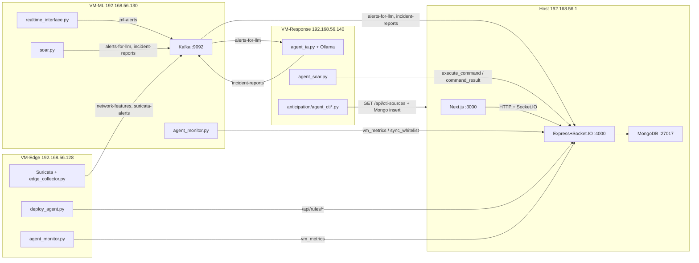
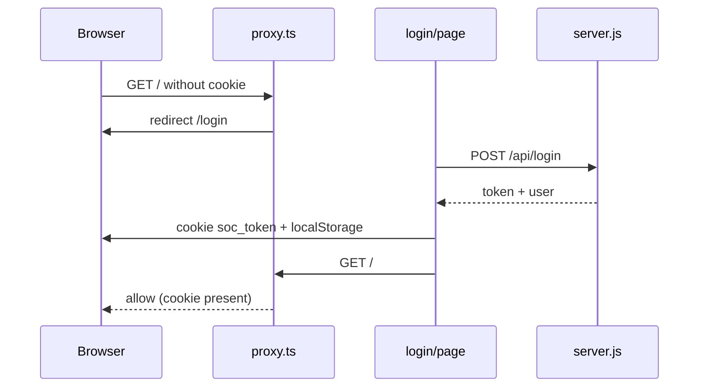
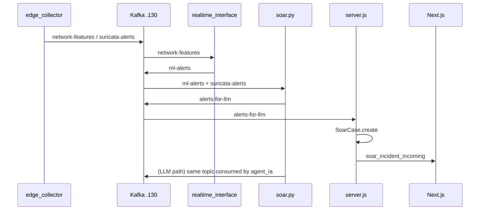

# NG-IDPS Frontend & Backend Technical Documentation

**Scope:** current implementation of `frontend/` and `backend/` as of the repository snapshot used to write this file. External VMs (`vm-edge/`, `vm-ml/`, `vm-response/`, `host/`) are documented only where they actually call or are called by the dashboard stack.

**Rules used while writing:** source code is the source of truth. Secrets are not copied. Contradictions between files are listed in [Inconsistencies / Open Questions](#inconsistencies--open-questions), not silently resolved.

---

## Project Overview

NG-IDPS is a laboratory **Next-Generation Intrusion Detection and Prevention System**. The Host machine runs:

- a **Next.js 16** SOC dashboard (`frontend/`, default TCP **3000**);
- a **Node.js Express + Socket.IO hub** (`backend/server.js`, TCP **4000**);
- **MongoDB** database `soc_dashboard` on `localhost:27017`.

The hub is not a generic REST microservice. It is a **control-plane hub**: it stores incidents and CTI in MongoDB, consumes Kafka topics produced by SOAR and the LLM agent, broadcasts Socket.IO events to the dashboard and to VM agents, and talks to Gemini (course generation) and Gmail SMTP (night alerts + LMS mail).

Detection and enforcement live on other VMs. The dashboard does **not** consume Suricata or LSTM-VAE Kafka topics directly.

---

## System Context



**Addressing used in running code (Host-Only LAN `192.168.56.0/24`):**

| Role | Address in source | Notes |
|------|-------------------|--------|
| Host (dashboard + hub + Mongo) | `192.168.56.1` | Hub hardcoded Kafka broker points at `.130` |
| VM-Edge (NIDS / iptables) | `192.168.56.128` | `vm-edge/agent_monitor.py` hostname `VM-Capteur-Suricata` |
| VM-ML (Kafka, LSTM-VAE, SOAR) | `192.168.56.130` | `vm-ml/agent_monitor.py` hostname `ML` |
| VM-Response (LLM + human actuator) | `192.168.56.140` | `vm-response/agent_soar.py` hostname `VM-Response` |

The infrastructure **page** initially paints placeholder IPs `.10` / `.20` / `.30`. Those are UI placeholders, replaced when Mongo `ipAddress` arrives. See [Inconsistencies](#inconsistencies--open-questions).

---

## Technology Stack

### Frontend (`frontend/package.json`, name `dashboard`)

| Item | Value in source |
|------|-----------------|
| Framework | Next.js **16.3.0** (App Router) |
| UI library | React **19.2.8** + React DOM **19.2.8** |
| Language | TypeScript |
| Styling | Tailwind CSS **4**, `tw-animate-css`, `clsx`, `tailwind-merge`, `class-variance-authority` |
| Component kit | shadcn style `base-nova` (`components.json`), `@base-ui/react` |
| Icons | `lucide-react` |
| Charts | `recharts` 3 |
| Diagrams | `mermaid` 11 (LMS attack diagrams) |
| PDF export | `jspdf` + `html2canvas` |
| Realtime | `socket.io-client` 4.8.3 |
| Mongo from Next | `mongoose` (used only by `GET /api/status`) |
| Listed but unused in `src/` | `jsonwebtoken` (present in `package.json`, no import in application TS/TSX) |
| Scripts | `dev` → `next dev`; `build` → `next build`; `start` → `next start`; `lint` → `eslint` |

### Backend (`backend/package.json`, name `websocket-hub`)

| Item | Value in source |
|------|-----------------|
| Runtime | Node.js CommonJS (`"type": "commonjs"`) |
| Framework | Express **5.2.1** |
| HTTP + WS | `http.createServer` + `socket.io` **4.8.3** |
| Kafka | `kafkajs` 2.2.4, `clientId: soc-dashboard-hub` |
| DB | `mongoose` 9 |
| Auth | `jsonwebtoken` |
| Config | `dotenv` |
| LLM (courses) | `@google/genai` |
| Mail | `nodemailer` |
| CORS | `cors` package, `app.use(cors())` with no origin restriction on REST |
| Entry | **`server.js`** (package `"main"` is still `index.js` — that file does not exist) |
| npm scripts | only `"test"` placeholder; **no `start` script**. Operators run `node server.js` |

### Host extras (`host/doc-host.md`)

`host/doc-host.md` states the Host also runs **Ollama** (`llama3.2:3b`) via `ollama serve`. Incident analysis in `vm-response/agent_ia.py` calls `http://localhost:11434` (the VM where that script runs), while CTI agents call `http://192.168.56.1:11434`. See contradictions.

---

## Repository Structure

Paths that matter for this document:

```text
NG-IDPS/
├── frontend/                 Next.js dashboard
│   ├── src/app/              App Router pages + Next API route
│   ├── src/components/       Layout, alerts, sidebar
│   ├── src/lib/              mongodb.ts + unused-by-hub Mongoose models
│   ├── src/proxy.ts          Next.js 16 request proxy (cookie gate)
│   └── next.config.ts
├── backend/
│   ├── server.js             Entire hub (REST + Kafka + Socket.IO)
│   ├── .env.exemple          Env variable names (no live secrets)
│   ├── actifs_critiques.json Whitelist file
│   ├── employes.json         LMS directory
│   └── simulate_alert.py     Socket.IO demo injector
├── host/doc-host.md          High-level Host description
├── vm-edge/                  Suricata collector, deploy agent, telemetry
├── vm-ml/                    LSTM-VAE, soar.py, Kafka broker host
├── vm-response/              agent_ia.py, agent_soar.py, CTI agents
└── docs/                     Existing architecture docs (not modified by this file)
```

`host/doc-host.md` draws a tree `host/frontend` and `host/backend`. Those folders **do not exist** under `host/`; the apps live at the repository root.

---

## Frontend Architecture

### Overview

- **Framework:** Next.js 16 App Router, `"use client"` on all SOC pages.
- **Language:** TypeScript.
- **Build tool:** Next.js (`next dev` / `next build`).
- **Main entry points:**
  - `frontend/src/app/layout.tsx` — root layout, metadata, `MainLayout`, `GlobalAlertListener`.
  - `frontend/src/app/page.tsx` — dashboard home (`/`).
  - `frontend/src/proxy.ts` — cookie-based route gate (Next 16 named export `proxy`, not `middleware.ts`).
- **Dev origin:** `next.config.ts` sets `allowedDevOrigins: ['192.168.56.1']` so browsing via the Host-Only IP works with `next dev`.

### How the UI talks to the hub

Every browser call uses:

```text
http://${window.location.hostname}:4000
```

If the operator opens `http://localhost:3000`, the hub is `http://localhost:4000`. If they open `http://192.168.56.1:3000`, the hub is `http://192.168.56.1:4000`. There is **no** Next.js rewrite or proxy from the UI to the hub. `GET /api/status` is a Next Route Handler that opens MongoDB **directly** (`connectDB` in `src/lib/mongodb.ts`); it does not call port 4000. No SOC page fetches `/api/status`.

### Frontend Structure

| Path | Role |
|------|------|
| `src/app/layout.tsx` | HTML shell, Inter font, global CSS, wraps children with `MainLayout` and mounts `GlobalAlertListener` on **every** page including login |
| `src/app/globals.css` | Tailwind / theme |
| `src/app/page.tsx` | Overview KPIs, charts, local alert banner, `DailyBriefingModal` |
| `src/app/login/page.tsx` | RSSI login form |
| `src/app/infrastructure/page.tsx` | Three VM cards + CPU/RAM line chart |
| `src/app/incidents/page.tsx` | SOAR case list, block/ignore, PDF export |
| `src/app/threat-intel/page.tsx` | CTI feed, sources, Suricata rule approve/edit, Gemini generate |
| `src/app/formations/page.tsx` | LMS catalogue, employee quiz, distribute, score table |
| `src/app/ia-activity/page.tsx` | LLM inference journal derived from incidents |
| `src/app/settings/page.tsx` | Whitelist CRUD UI |
| `src/app/api/status/route.ts` | Next server route: Mongo ping (not called by SOC pages in `src/`) |
| `src/components/MainLayout.tsx` | Sidebar + `ml-64` except on `/login` |
| `src/components/Sidebar.tsx` | Nav, open-incident badge, logout, `NotificationCenter` |
| `src/components/NotificationCenter.tsx` | Bell dropdown of live incidents |
| `src/components/GlobalAlertListener.tsx` | Bottom-right siren toasts + Web Audio |
| `src/components/DailyBriefingModal.tsx` | Post-login briefing (JWT) |
| `src/components/ui/button.tsx` | shadcn Button |
| `src/lib/utils.ts` | `cn()` class merger |
| `src/lib/mongodb.ts` | Next-side Mongo connect (`MONGODB_URI` or localhost) |
| `src/lib/models/VmNode.ts` | **Not imported anywhere** (neither hub nor any `frontend/src` page). Stricter than `server.js` |
| `src/lib/models/SoarCase.ts` | **Not imported anywhere.** Field names differ (`aiConfidence` vs `aiConfidenceScore`) |
| `src/proxy.ts` | Cookie presence check. Matcher also excludes `noise.png` (that file is **not** in `public/`) |
| `public/` | Only `file.svg`, `vercel.svg`, `window.svg` are present. Overview still calls `new Audio('/alert.mp3')` — **that file is not in `public/`**, so playback fails (caught). No `favicon.ico` in-tree |

State is **React `useState` / `useEffect` per page**. There is no Redux, Zustand, or React Query. Shared “state” is:

- cookie `soc_token`;
- `localStorage.soc_user`, `localStorage.soc_last_logout`;
- `sessionStorage.briefing_seen`;
- Socket.IO events.

---

## Frontend Routes

App Router pages (every `page.tsx` under `src/app`):

| Route | File | Purpose | Authentication | Role |
|-------|------|---------|----------------|------|
| `/login` | `src/app/login/page.tsx` | RSSI login | Public. If cookie `soc_token` exists, `proxy.ts` redirects to `/` | None until login succeeds |
| `/` | `src/app/page.tsx` | SOC overview KPIs and charts. KPI “Temps de Réponse &lt; 1.5s” is **hardcoded**, not from an API | Cookie `soc_token` required (presence only) | UI shows `soc_user.role`; no extra page-level role check |
| `/infrastructure` | `src/app/infrastructure/page.tsx` | VM telemetry | Cookie required | Same |
| `/incidents` | `src/app/incidents/page.tsx` | SOAR incidents, block/ignore, PDF | Cookie required | Same |
| `/threat-intel` | `src/app/threat-intel/page.tsx` | CTI feed and rule workflow | Cookie required | Same |
| `/formations` | `src/app/formations/page.tsx` | LMS | Cookie required **unless** query `courseId` is present (`proxy.ts` exception) | Admin UI if `localStorage.soc_user.role === "RSSI"`; employee path after `/api/employes/verify` |
| `/formations?courseId=<id>` | same | Employee course from email link | No SOC cookie | Employee ID in `employes.json` |
| `/ia-activity` | `src/app/ia-activity/page.tsx` | LLM JSON journal | Cookie required | Same |
| `/settings` | `src/app/settings/page.tsx` | Critical-asset whitelist | Cookie required | Same |

**Next.js Route Handler (not the Node hub):**

| Route | File | Purpose | Authentication |
|-------|------|---------|----------------|
| `GET /api/status` | `src/app/api/status/route.ts` | `{ connected, message }` from Mongoose `readyState` | Not gated by `proxy.ts` matcher (`api` excluded). No JWT |

No other App Router dynamic segments exist (`[id]`, etc.).

---

## Frontend Components

| Component | Responsibility |
|-----------|----------------|
| `MainLayout` | Hide sidebar on `/login`; otherwise fixed sidebar + padded main |
| `Sidebar` | Seven nav links; load `/api/incidents`; live `soar_incident_incoming` / `soar_incident_updated`; open-count badge; display `soc_user`; logout |
| `NotificationCenter` | In-memory list of `soar_incident_incoming`; mark read; link to `/incidents` |
| `GlobalAlertListener` | Always mounted; Web Audio square-wave siren; stacked toasts; **connects Socket.IO even on `/login`** |
| `DailyBriefingModal` | Once per browser session (`briefing_seen`); `POST /api/briefing` with Bearer token |
| `MermaidDiagram` (inline in formations page) | Renders `formation_data.diagramme_mermaid` |
| `AiReportFormatter` (inline in incidents page) | Renders `diagnostic_json` or fallback `aiSummary` |
| `AiActivityCard` (inline in ia-activity) | Expandable prompt/JSON (prompt usually empty; hub does not persist `prompt_contexte`) |
| Threat-intel `Trash2` on a source | **Decorative.** No `onClick` and **no** `DELETE /api/cti-sources` on the hub |
| `ui/button` | Generic button primitives (SOC pages mostly use raw `<button>`) |

---

## Frontend API Communication

Base URL pattern: `http://${window.location.hostname}:4000`.

Headers: `Content-Type: application/json` on POST/DELETE JSON bodies. Bearer token **only** on `POST /api/briefing`, `POST /api/formations/distribute`, `GET /api/formations/records`.

Error handling is per-call (`console.error`, inline UI strings, occasional `alert`). There is no shared API client or interceptor.

### POST `/api/login`

- **Caller:** `frontend/src/app/login/page.tsx`
- **Purpose:** obtain JWT and user profile
- **Body:** `{ username, password }`
- **Success:** `data.success` → cookie `soc_token=<token>; path=/; max-age=28800; samesite=strict`; `localStorage.soc_user = JSON.stringify(data.user)`; `router.push("/")`
- **Failure:** shows `data.error` or “Serveur SOC injoignable.”
- **Hub:** `POST /api/login`

### GET `/api/incidents`

- **Callers:** `page.tsx`, `Sidebar.tsx`, `incidents/page.tsx`, `ia-activity/page.tsx`
- **Purpose:** last 50 SOAR cases
- **Auth header:** none
- **Hub:** `GET /api/incidents`

### GET `/api/vms`

- **Callers:** `page.tsx`, `infrastructure/page.tsx`
- **Purpose:** VM documents for KPIs / cards
- **Hub:** `GET /api/vms`

### GET `/api/whitelist`

- **Caller:** `settings/page.tsx`
- **Fallback on error:** hardcoded IP list `.128`, `.130`, `.140`, `.1`
- **Hub:** `GET /api/whitelist`

### POST `/api/whitelist`

- **Caller:** `settings/page.tsx`
- **Body:** `{ ip, description }` — hub stores **only** `ip` (`description` is ignored)
- **UI:** IPv4 regex; optimistic update (`if (res.ok || true)`)
- **Hub:** `POST /api/whitelist` — `sync_whitelist` emitted **only if the IP was newly appended**

### DELETE `/api/whitelist`

- **Caller:** `settings/page.tsx`
- **Body:** `{ ip }`
- **Hub:** `DELETE /api/whitelist`

### GET `/api/cti-actualities`

- **Callers:** `threat-intel/page.tsx` (poll every 15 s), `formations/page.tsx`
- **Hub:** `GET /api/cti-actualities`

### GET `/api/cti-sources`

- **Caller:** `threat-intel/page.tsx`
- **Hub:** `GET /api/cti-sources` (active sources only)

### POST `/api/cti-sources`

- **Caller:** `threat-intel/page.tsx`
- **Body:** `{ nom, url, type_source: "RSS" }`
- **Hub:** `POST /api/cti-sources`

### POST `/api/rules/update-status`

- **Caller:** `threat-intel/page.tsx` `handleDeployRule`
- **Body:** `{ rule_id, status: "APPROVED" }`
- **Hub:** `POST /api/rules/update-status`

### POST `/api/rules/edit`

- **Caller:** `threat-intel/page.tsx` `handleSaveEdit`
- **Body:** `{ rule_id, new_rule }`
- **Hub:** `POST /api/rules/edit`

### POST `/api/formations/generate`

- **Caller:** `threat-intel/page.tsx`
- **Body:** `{ rule_id, titre_menace, resume_ia }` (`source_texte` not sent by UI)
- **Hub:** `POST /api/formations/generate` (Gemini)

### GET `/api/employes`

- **Caller:** `formations/page.tsx` (department keys)
- **Hub:** `GET /api/employes`

### POST `/api/formations/distribute`

- **Caller:** `formations/page.tsx`
- **Headers:** `Authorization: Bearer <soc_token cookie>`
- **Body:** `{ rule_id, formation_data, targetType, targetValue }`
- **401/403:** `alert("Erreur de sécurité : Session expirée ou privilèges insuffisants.")`
- **Hub:** `POST /api/formations/distribute`

### GET `/api/formations/records`

- **Caller:** `formations/page.tsx` when view mode `SUIVI`
- **Headers:** Bearer cookie
- **Hub:** `GET /api/formations/records`

### POST `/api/employes/verify`

- **Caller:** `formations/page.tsx` employee gate
- **Body:** `{ id_employe }`
- **Hub:** `POST /api/employes/verify`

### POST `/api/formations/submit`

- **Caller:** `formations/page.tsx` after quiz
- **Body:** `{ courseId, courseTitle, employeeId, employeeName, department: employeeAuth.poste, score }` — `department` is the employee **poste** string, not the JSON department key
- **Hub:** `POST /api/formations/submit`

### POST `/api/briefing`

- **Caller:** `DailyBriefingModal.tsx`
- **Headers:** Bearer cookie
- **Body:** `{ last_logout }` from `localStorage.soc_last_logout` (may be `null`)
- **Hub:** `POST /api/briefing`

### GET `/api/status` (Next, not hub)

- **Caller:** none found under `frontend/src`
- **File:** `frontend/src/app/api/status/route.ts`

The hub route `GET /api/simulate-attack` is **not** called by the frontend.

---

## Frontend Authentication

1. **Login:** form posts to hub `/api/login`.
2. **Token storage:** cookie `soc_token`, `max-age=28800` (8 hours, matches JWT `expiresIn: '8h'`), `samesite=strict`. **Not** `httpOnly` (JavaScript can read it for Bearer calls). **Not** `Secure` (HTTP lab).
3. **Token retrieval:** `document.cookie` parsed in briefing, distribute, and records callers.
4. **Protected routes:** `src/proxy.ts` checks **cookie presence**, not JWT signature, expiry, or role.
5. **Logout:** `Sidebar.handleLogout` writes `soc_last_logout`, clears `briefing_seen` and `soc_user`, expires cookie, `router.push("/login")`. Hub is not notified.
6. **Role handling:** JWT claim `role: "RSSI"`. UI reads `localStorage.soc_user.role`. LMS admin buttons require `role === "RSSI"`. Hub enforces RSSI only on three routes (`verifySOCAdmin`).

Employee LMS is a **separate** check: `POST /api/employes/verify` against `employes.json`. No JWT for employees.

---

## Frontend WebSocket / Socket.io

Client: `io(http://${host}:4000)` (default Engine.IO path `/socket.io/`).

| Event | Direction | Payload | Sender | Receiver | Purpose |
|-------|-----------|---------|--------|----------|---------|
| `connect` / `disconnect` | hub ↔ client | Socket.IO built-in | both | incidents + ia-activity pages set `wsConnected` | Connection LED |
| `soar_incident_incoming` | hub → UI | Mongoose `SoarCase` document | hub Kafka / simulate / `new_security_alert` | `GlobalAlertListener`, `NotificationCenter`, `Sidebar`, `incidents/page.tsx` | New case toast, list prepend, siren |
| `soar_incident_updated` | hub → UI | Updated `SoarCase` | hub after LLM report / block / ignore / `command_result` **and only if `activeAdmins > 0`** (night Auto-Pilot path emails instead and **does not** emit this) | `Sidebar`, `incidents`, `ia-activity` | Refresh case / IA journal |
| `dashboard_update` | hub → UI | `VmNode` document | hub after `vm_metrics` or watchdog | `page.tsx` (refetch), `infrastructure/page.tsx` (merge card) | Telemetry |
| `new_incident` | **UI listens; hub never emits this name** | expected incident-like object | — | `page.tsx` | Intended in-app banner + `/alert.mp3`; **dead listener** |
| `send_command` | UI → hub | `{ action, targetIp, sensor, incidentId }` | `incidents/page.tsx` | hub | `BLOCK_IP` or `IGNORE_INCIDENT` |
| `execute_command` | hub → agents | same object (broadcast) | hub | `vm-response/agent_soar.py` (not the React UI) | iptables |
| `command_result` | agent → hub | `{ incidentId, ip, status }` | `agent_soar.py` | hub | Final case status |
| `vm_metrics` | agent → hub | hostname, ip, cpu, ram, services | `agent_monitor.py` | hub | Upsert VM |
| `sync_whitelist` | hub → agents | `string[]` of IPs | hub whitelist REST | `vm-ml/agent_monitor.py` | Rewrite `/home/aziz/dataset/actifs_critiques.json` (not automatically `soar.py`’s relative file) |
| `new_security_alert` | simulator → hub | SoarCase-like object | `backend/simulate_alert.py` | hub | Demo inject |

**Settings page** imports `socket.io-client` and declares unused `WhitelistItem` but **never calls `io()`**. Whitelist sync is not shown live in the settings UI.

**`/ia-activity`:** listens only to `soar_incident_updated` (not `soar_incident_incoming`). The “Agent IA En Ligne” LED is `socket.connected` to the **hub**, not a health check of `agent_ia.py` or Ollama. The label `Llama-3.2:3B` is hardcoded in JSX.

**Incidents page** opens a **new** Socket.IO connection for each block/ignore, emits, then `disconnect()` after 1 second.

**Overview page** live banner depends on `new_incident`, which is never emitted. Live alerts on that page therefore do not fire from hub Kafka; `GlobalAlertListener` still toasts `soar_incident_incoming` globally.

---

## Backend Architecture

### Overview

- **Framework:** Express 5
- **Runtime:** Node.js CommonJS
- **Entry:** `backend/server.js`
- **Port:** hardcoded `4000` (`const PORT = 4000`)
- **Middleware:** `cors()` (all origins for REST), `express.json()`
- **Socket.IO CORS:** `origin: ["http://localhost:3000", "http://192.168.56.1:3000"]`, methods `GET`, `POST`, `DELETE`
- **Mongo:** `mongoose.connect('mongodb://localhost:27017/soc_dashboard')` — URI **not** taken from env
- **Kafka:** brokers `['192.168.56.130:9092']`, group `dashboard-group`, topics `alerts-for-llm`, `incident-reports`
- **Config:** `dotenv` loads `GEMINI_API_KEY`, `JWT_SCRT`, `EMAIL_PASS`

### Backend Structure

| File | Role |
|------|------|
| `server.js` | All REST routes, schemas, Kafka consumer, Socket.IO, SMTP, Gemini, watchdog |
| `.env.exemple` | Placeholder names for the three env vars |
| `actifs_critiques.json` | `{ "whitelist": [ ... ] }` |
| `employes.json` | Department → array of `{ id_employe, nom, email, poste }` |
| `simulate_alert.py` | One-shot Socket.IO `new_security_alert` to `localhost:4000` |

There is no `routes/`, `controllers/`, or `models/` directory. Models are inline Mongoose schemas in `server.js`.

---

## REST API Reference

Hub base: `http://localhost:4000` or `http://192.168.56.1:4000`.

### Summary table

| Method | Endpoint | Auth | Role | Purpose |
|--------|----------|------|------|---------|
| POST | `/api/login` | No | Issues RSSI JWT | Laboratory login |
| GET | `/api/cti-sources` | No | — | Active OSINT sources (Python CTI + UI) |
| POST | `/api/cti-sources` | No | — | Add source |
| GET | `/api/cti-actualities` | No | — | Latest 50 CTI documents |
| GET | `/api/incidents` | No | — | Latest 50 SOAR cases |
| GET | `/api/vms` | No | — | All VM nodes |
| GET | `/api/whitelist` | No | — | Read whitelist file |
| POST | `/api/whitelist` | No | — | Append IP if new; `sync_whitelist` only then |
| DELETE | `/api/whitelist` | No | — | Remove IP + `sync_whitelist` |
| POST | `/api/rules/update-status` | No | — | CTI/rule status (UI + edge agent) |
| POST | `/api/rules/edit` | No | — | Edit Suricata text, reset PENDING |
| GET | `/api/rules/pending-deploy` | No | — | Rules with `status === "APPROVED"` |
| POST | `/api/formations/generate` | No | — | Gemini micro-learning JSON |
| GET | `/api/employes` | No | — | Full `employes.json` |
| POST | `/api/formations/distribute` | Bearer JWT | `role === "RSSI"` | Per-employee SMTP campaign |
| POST | `/api/employes/verify` | No | — | LMS employee login |
| POST | `/api/formations/submit` | No | — | Upsert quiz score |
| GET | `/api/formations/records` | Bearer JWT | RSSI | All formation records |
| POST | `/api/briefing` | Bearer JWT | RSSI | Absence-period summary |
| GET | `/api/simulate-attack` | No | — | Emit mock WS incident (no Mongo write) |

There is no `app.delete` for CTI sources, no REST update for incidents, and no REST block-IP endpoint (blocking is Socket.IO).

---

### POST `/api/login`

**Purpose:** Issue JWT for the laboratory RSSI account.

**Authentication:** None.

**Headers:** `Content-Type: application/json`

**Parameters:** none (body only)

| Name | Location | Required | Type | Description |
|------|----------|----------|------|-------------|
| username | body | yes | string | Compared to hardcoded `adminUser.username` |
| password | body | yes | string | Compared to hardcoded `adminUser.password` in `server.js` |

**Request body:**

```json
{ "username": "<string>", "password": "<string>" }
```

**Response (200):**

```json
{
  "success": true,
  "token": "<jwt>",
  "user": { "name": "Administrateur SOC", "role": "RSSI" }
}
```

JWT payload signed with `process.env.JWT_SCRT`: `{ id, username, role }`, `expiresIn: '8h'`.

**Status codes:** `200` success; `401` `{ success: false, error: "Identifiants SOC invalides." }`

**Database:** none.

**Frontend caller:** `login/page.tsx`

**External effects:** none (log line only).

---

### GET `/api/cti-sources`

**Purpose:** Return CTI sources with `actif: true` for the dashboard and Python CTI agents.

**Authentication:** None.

**Response:** JSON array of `CtiSource` documents.

**Status codes:** `200`; `500` `{ error: "Erreur lors de la lecture des sources CTI" }`

**Database:** `CtiSource.find({ actif: true })`

**Frontend caller:** `threat-intel/page.tsx`

**External:** `vm-response/anticipation/agent_cti.py` (and variants) `API_SOURCES_URL`

---

### POST `/api/cti-sources`

**Purpose:** Create an OSINT source.

| Name | Location | Required | Type | Description |
|------|----------|----------|------|-------------|
| nom | body | yes | string | Display name |
| url | body | yes | string | Feed/API URL |
| type_source | body | no | string | Default `"URL"` in schema; UI sends `"RSS"` |

**Response:** `{ success: true, source: <doc> }`

**Status codes:** `200`; `400` missing nom/url; `500` insert error

**Frontend:** `threat-intel/page.tsx`

---

### GET `/api/cti-actualities`

**Purpose:** CTI/LMS catalogue.

**Response:** up to 50 `CtiActuality`, `date_publication` descending.

**Status:** `200` / `500`

**Frontend:** `threat-intel/page.tsx`, `formations/page.tsx`

**Also written by:** CTI Python agents via **direct Mongo** (`mongodb://192.168.56.1:27017/`, collection `ctiactualities`), not this GET.

---

### GET `/api/incidents`

**Purpose:** Hydrate SOAR UI.

**Response:** up to 50 `SoarCase`, `timestamp` descending.

**Status:** `200` / `500`

**Frontend:** overview, sidebar, incidents, ia-activity

---

### GET `/api/vms`

**Purpose:** List VM telemetry documents.

**Response:** all `VmNode`

**Frontend:** overview, infrastructure

---

### GET `/api/whitelist`

**Purpose:** Read `backend/actifs_critiques.json` (`whitelist` or `actifs_critiques` key). On read failure, default list `.128`, `.130`, `.140`, `.1`.

**Response:** `{ "whitelist": ["...", "..."] }`

**Frontend:** `settings/page.tsx`

---

### POST `/api/whitelist`

| Name | Location | Required | Type | Description |
|------|----------|----------|------|-------------|
| ip | body | yes | string | Appended if not already present |

**Response:** `{ success: true, whitelist: [...] }`

**Status:** `200`; `400` missing ip; `500`

**Database:** none (filesystem)

**External:** `io.emit('sync_whitelist', list)` **only inside `if (!list.includes(ip))`** after append. VM-ML `agent_monitor.py` writes `/home/aziz/dataset/actifs_critiques.json`. `soar.py` reads a **different** relative path `actifs_critiques.json` (cwd of the SOAR process). See inconsistencies.

**Frontend:** `settings/page.tsx`

---

### DELETE `/api/whitelist`

Same body `ip`; filters list; **always** emits `sync_whitelist` even if the IP was not in the list.

---

### POST `/api/rules/update-status`

| Name | Location | Required | Type | Description |
|------|----------|----------|------|-------------|
| rule_id | body | yes | string | Mongo `_id` of `CtiActuality` |
| status | body | yes | string | e.g. `APPROVED`, `DEPLOYED`, `REJECTED` |
| error_log | body | no | string | Set or null |

**Response:** `{ message: "Statut mis à jour", new_status }` or `404` `{ error: "Règle introuvable" }`

**Frontend:** threat-intel (`APPROVED`)

**External:** `vm-edge/deploy_agent.py` posts `DEPLOYED` / `REJECTED`

---

### POST `/api/rules/edit`

| Name | Location | Required | Type | Description |
|------|----------|----------|------|-------------|
| rule_id | body | yes | string | Document id |
| new_rule | body | yes | string | Suricata rule text |

Sets `regles_suricata`, `status: "PENDING"`, `error_log: null`.

**Response:** `{ message: "Règle corrigée et remise en attente", rule }` (`rule` may be `null` if the id does not exist — **no 404** in this handler).

---

### GET `/api/rules/pending-deploy`

**Purpose:** Edge deploy loop.

**Response:** `{ count, rules }` where `status === "APPROVED"`

**Frontend:** none

**Caller:** `vm-edge/deploy_agent.py` every 10 seconds

---

### POST `/api/formations/generate`

| Name | Location | Required | Type | Description |
|------|----------|----------|------|-------------|
| rule_id | body | yes | string | Valid Mongo ObjectId |
| titre_menace | body | no | string | Injected into Gemini prompt |
| resume_ia | body | no | string | Injected into prompt |
| source_texte | body | no | string | Optional extra OSINT |

**Response:** `{ message, formation }` where `formation` is parsed Gemini JSON (`titre_cours`, `diagramme_mermaid`, `modules[]`, `quiz[]`).

Side effect: `CtiActuality` `status: "FORMATION_GENERATED"`, `formation_data` set.

**Status:** `400` missing/invalid id; `404` unknown id; `500` `{ error, details }` Gemini/parse failure

**External:** Google Gemini model **`gemini-3.6-flash`**, `responseMimeType: application/json`

**Frontend:** `threat-intel/page.tsx`

---

### GET `/api/employes`

**Response:** parsed `employes.json` object, or `{}` if file missing.

**Frontend:** formations (department dropdown)

---

### POST `/api/formations/distribute`

**Authentication:** `verifySOCAdmin` (Bearer JWT, role RSSI).

| Name | Location | Required | Type | Description |
|------|----------|----------|------|-------------|
| rule_id | body | yes (checked with formation_data) | string | Used in LMS URL |
| formation_data | body | yes | object | Must include `titre_cours`, `modules[0].contenu` |
| targetType | body | no | string | `"DEPARTEMENT"` or else treated as ALL |
| targetValue | body | if DEPARTEMENT | string | Key in `employes.json` |

**Response:** `{ message: "Campagne personnalisée diffusée avec succès !", count }`

**Status:** `401`/`403` middleware; `400` missing data or no recipients; `500`

**External:** Nodemailer Gmail; one mail per employee; link `http://localhost:3000/formations?courseId={rule_id}` (hardcoded localhost, not Host-Only IP)

**Frontend:** `formations/page.tsx`

---

### POST `/api/employes/verify`

| Name | Location | Required | Type | Description |
|------|----------|----------|------|-------------|
| id_employe | body | yes | string | Match in any department list |

**Response:** `{ success: true, employe }` or `401` `{ success: false, error }`

**Frontend:** formations student gate

---

### POST `/api/formations/submit`

| Name | Location | Required | Type | Description |
|------|----------|----------|------|-------------|
| courseId | body | for upsert key | string | With employeeId unique pair |
| courseTitle | body | no | string | Stored |
| employeeId | body | for upsert key | string | |
| employeeName | body | no | string | |
| department | body | no | string | UI sends `poste` |
| score | body | no | number | Percent |

Upsert `FormationRecord` on `{ courseId, employeeId }`.

**Frontend:** formations quiz

---

### GET `/api/formations/records`

**Auth:** `verifySOCAdmin`

**Response:** all records, `completedAt` descending.

**Frontend:** formations view `SUIVI`

---

### POST `/api/briefing`

**Auth:** `verifySOCAdmin`

| Name | Location | Required | Type | Description |
|------|----------|----------|------|-------------|
| last_logout | body | no | string ISO | Default window: now − 12 hours |

**Response:**

```json
{
  "success": true,
  "since": "<Date>",
  "summary": {
    "total_incidents": 0,
    "auto_blocked": 0,
    "critical_alerts": 0,
    "new_cti": 0,
    "new_formations": 0
  },
  "recent_incidents": []
}
```

`auto_blocked`: `caseStatus` contains `Nuit` **or** `Auto-Pilote` **or** `bloqué`.  
`critical_alerts`: `aiConfidenceScore >= 80`.  
`new_formations`: CTI with `status === "FORMATION_GENERATED"`.  
`recent_incidents`: first 3 of the period.

**Frontend:** `DailyBriefingModal.tsx`

---

### GET `/api/simulate-attack`

**Purpose:** Demo. Builds a mock object with `_id` prefix `SIM-`, IP `185.15.59.224`, emits `soar_incident_incoming`. **Does not insert Mongo.**

**Response:** `{ success: true, message: "Missile de test envoyé avec succès vers le frontend !" }`

**Frontend:** none (manual HTTP)

---

## Authentication & Authorization

### Login

Hardcoded `adminUser` in `server.js` (id `ADMIN-001`, role `RSSI`, display name `Administrateur SOC`). Username and password are **source constants**, not env vars. This is a laboratory lock, not production IAM.

### JWT

- Secret: `process.env.JWT_SCRT` (name is `JWT_SCRT`, not `JWT_SECRET`).
- `jwt.sign` / `jwt.verify` are called with **no** `algorithm` option (library default applies).
- Expiry: 8 hours.
- Claims: `id`, `username`, `role`.

If `JWT_SCRT` is undefined, `jwt.sign` / `jwt.verify` still run with `undefined` secret (operational hazard).

### Middleware `verifySOCAdmin`

1. Require `Authorization` starting with `Bearer `.
2. `jwt.verify(token, JWT_SECRET)`.
3. `decoded.role !== 'RSSI'` → **403** `{ error: "Privilèges insuffisants pour cette action." }`
4. Missing/invalid token → **401** (two different French error strings).

Applied only to: distribute, records, briefing.

### Frontend

Cookie presence in `proxy.ts`. JWT is not verified at the edge. Most hub APIs remain callable without a token from any client that can reach port 4000.

### Unauthorized / forbidden

| Code | When |
|------|------|
| 401 | Bad login; missing Bearer; invalid/expired JWT |
| 403 | Valid JWT but role ≠ RSSI |

---

## Database Architecture

MongoDB database name: **`soc_dashboard`**.

Mongoose default collection names (lowercase plural): `vmnodes`, `soarcases`, `ctisources`, `ctiactualities`, `formationrecords`.

**Authoritative schemas are in `backend/server.js`.** Frontend `src/lib/models/*.ts` are **not** registered by the hub and **contradict** field names/enums.

### VmNode (`server.js`)

`{ strict: false }` — extra keys from agents are stored.

| Field | Type | Required | Default | Description |
|-------|------|----------|---------|-------------|
| hostname | String | yes, unique | — | Match key for UI cards and upserts |
| ipAddress | String | no | — | From `vm_metrics` |
| os | String | no | — | |
| cpuUsage | Number | no | — | |
| ramUsage | Number | no | — | |
| services | Array | no | — | `{ name, active }` from monitors |
| lastHeartbeat | Date | no | `Date.now` | Watchdog uses this |
| nodeStatus | String | no | set to `Online` on metrics; `Hors Ligne` on watchdog | UI compares to `"Online"` |

**CRUD:** upsert on `vm_metrics`; read `GET /api/vms`; watchdog update.

**Frontend:** infrastructure + overview node count.

**Frontend model extra fields** (`diskUsage`, service enum `running|stopped|failed`, `Offline|Degraded`) are **not** what the hub writes.

### SoarCase (`server.js`)

| Field | Type | Required | Default | Description |
|-------|------|----------|---------|-------------|
| kibanaUrl | String | no | — | Optional Kibana link |
| sourceSensor | String | no | Kafka uses `source_detection` | |
| maliciousIp | String | no | Kafka `src_ip` | |
| threatType | String | no | Placeholder then LLM title | |
| severity | String | no | Often empty on Kafka create | |
| aiSummary | String | no | Placeholder then LLM `resume_executif` | |
| diagnostic_json | Object | no | `null` | Llama JSON |
| aiConfidenceScore | Number | no | 0 then composite score | |
| duree_generation_sec | Number | no | | From Kafka payload |
| caseStatus | String | no | `"Ouvert"` | Many free-text statuses (not an enum in hub) |
| timestamp | Date | no | `Date.now` | |

**No unique index** on IP. Kafka matching uses latest document with `maliciousIp` + `caseStatus` regex `/^Analyse IA/`.

**CRUD:** create on `alerts-for-llm` and `new_security_alert`; update on `incident-reports`, commands, results; read `GET /api/incidents` and briefing.

**Frontend model** uses `aiConfidence`, `createdAt`, nested `actions[]`, enum statuses — **not** the live documents.

### CtiSource

| Field | Type | Required | Default | Description |
|-------|------|----------|---------|-------------|
| nom | String | yes | — | |
| url | String | yes | — | |
| type_source | String | no | `"URL"` | |
| actif | Boolean | no | true | GET filters true |
| date_ajout | Date | no | now | |

No unique constraint on URL.

### CtiActuality

| Field | Type | Required | Default | Description |
|-------|------|----------|---------|-------------|
| titre_menace | String | no | — | |
| source_osint | String | no | — | |
| url_article | String | no | — | |
| resume_ia | String | no | — | |
| type_article | String | no | `"TECHNICAL_THREAT"` | or `AWARENESS` |
| iocs_extraits | Array | no | — | |
| regles_suricata | String | no | — | |
| fiabilite_score | Number | no | — | |
| status | String | no | `"PENDING"` | PENDING, APPROVED, DEPLOYED, REJECTED, FORMATION_GENERATED |
| error_log | String | no | null | Dry-run failures |
| formation_data | Object | no | null | Gemini JSON |
| last_updated | Date | no | now | |
| date_publication | Date | no | now | |

Python CTI inserts into the same collection with Pydantic-shaped fields plus extras (`source_osint`, etc.).

### FormationRecord

| Field | Type | Required | Default | Description |
|-------|------|----------|---------|-------------|
| courseId | String | no | — | CTI `_id` |
| courseTitle | String | no | — | |
| employeeId | String | no | — | |
| employeeName | String | no | — | |
| department | String | no | — | |
| score | Number | no | — | |
| completedAt | Date | no | now | |

Upsert key `{ courseId, employeeId }` (not a schema unique index; enforced in `findOneAndUpdate` filter).

### Files used as data stores

| File | Role |
|------|------|
| `backend/actifs_critiques.json` | Whitelist |
| `backend/employes.json` | LMS directory (emails used by SMTP) |

---

## Kafka Integration

Hub **consumes only**; it never produces Kafka messages.

Broker in hub and VM Python: **`192.168.56.130:9092`**. No SASL/SSL in code.

| Topic | Producer (in-repo) | Consumer (in-repo) | Payload (actual fields) | Purpose |
|-------|--------------------|--------------------|-------------------------|---------|
| `network-features` | `vm-edge/edge_collector.py` | `vm-ml/lstm-vae/realtime_interface.py` | 16-D feature dict + `src_ip` (see collector) | LSTM-VAE input |
| `suricata-alerts` | `edge_collector.py` | `vm-ml/soar.py` (`TOPIC_SURICATA`) | Alert object including `src_ip` / `signature` / `severity` / `category` | Signature stream |
| `ml-alerts` | `realtime_interface.py` | `soar.py` | `{ action, src_ip, mse, ... }` e.g. `AUTO_BLOCK_IP`, `ENABLE_DDOS_SHIELD` | Anomaly / flood |
| `alerts-for-llm` | `soar.py` `notifier_agent_ia` / DDoS shield | **hub** `dashboard-group` **and** `vm-response/agent_ia.py` `agent-ia-group` | `{ src_ip, source_detection, details, auto_blocked, timestamp }` | Create pending SoarCase + LLM prompt |
| `incident-reports` | `agent_ia.py`; also `soar.py` Zero-Trust bypass | **hub** | LLM: `{ src_ip, diagnostic_json, prompt_contexte, timestamp, duree_generation_sec }`; bypass: `{ src_ip, diagnostic }` | Enrich SoarCase |
| `lstm-vae-scores` | **Declared only** (`KAFKA_TOPIC_LSTM_SCORES` in `edge_collector.py`) | **No `producer.send` and no consumer** in the repository | — | Dead constant |

### Hub message flow (`startKafkaConsumer`)

**A. `alerts-for-llm`**

1. If `src_ip` not in whitelist → record `lastExternalAttackTime`.
2. If whitelisted **and** last external attack &lt; 180000 ms → **return** (mute collateral MSE).
3. Else create `SoarCase` with status `Analyse IA (Auto-bloqué)` or `Analyse IA (Action requise)`.
4. Always `io.emit('soar_incident_incoming', savedIncident)` (even if no admin).

**B. `incident-reports`**

1. Find latest case for that IP with `caseStatus` matching `/^Analyse IA/`.
2. If **none**, log and **drop** (Zero-Trust bypass that never created an `Analyse IA` case is not attached).
3. Parse `diagnostic_json`; if empty, synthesize Zero-Trust JSON from `diagnostic` / `aiSummary`.
4. Composite score: `0.4 * Suricata + 0.3 * ML + 0.3 * LLM` (`calculerScoreMenaceCompose`). Defaults when fields are missing: Suricata **50** (100 if severity text contains `critique`, 80 if `élevé`/`haut`); ML **`payload.ml_anomaly_score || 75`** (`agent_ia.py` does **not** send `ml_anomaly_score`); LLM **`diagnostic_json.score_confiance || 80`**.
5. Status:
   - `activeAdmins === 0` and score ≥ 85 and not whitelist → `Bannie (Auto-Pilote / Mode Nuit)` + emit `execute_command` BLOCK_IP;
   - whitelist → `Alerte Zero Trust (Protégée)`;
   - previous auto-block status → `Bannie (Auto-Remédiation)`;
   - else `Ouvert`.
6. If `activeAdmins > 0` → `soar_incident_updated`; else SMTP night email (no WS update).

Frontend never talks to Kafka.

---

## WebSocket / Socket.io Integration

Server: `new Server(server, { cors: { origin: [localhost:3000, 192.168.56.1:3000] } })` on the same HTTP server as Express.

**Admin counting:** `socket.handshake.headers.origin` equals one of those two URLs → `activeAdmins++`. Python agents typically send **no** Origin and are logged as “Capteur”. This counter is **not** “number of human operators”: a single logged-in browser opens **several** dashboard sockets at once (`GlobalAlertListener` + `Sidebar` + `NotificationCenter` + the current page). `/login` still mounts `GlobalAlertListener`, so `activeAdmins` can be ≥ 1 with nobody authenticated. Night email / Auto-Pilot run only when `activeAdmins === 0`.

| Event | Direction | Sender | Receiver | Payload | Purpose |
|-------|-----------|--------|----------|---------|---------|
| connection | — | client | hub | handshake | Admin vs sensor |
| `vm_metrics` | in | edge/ML monitors | hub | metrics object | Upsert VmNode, emit `dashboard_update` |
| `dashboard_update` | out | hub | UI | VmNode | Live cards |
| `new_security_alert` | in | `simulate_alert.py` | hub | alert object | `SoarCase.create`; emit incoming **only if** `activeAdmins > 0` |
| `soar_incident_incoming` | out | hub | UI | SoarCase | New ticket |
| `soar_incident_updated` | out | hub | UI | SoarCase | Status/LLM update |
| `send_command` | in | incidents UI | hub | command | Broadcast `execute_command`; update status |
| `execute_command` | out | hub | `agent_soar.py` | command | iptables BLOCK_IP |
| `command_result` | in | `agent_soar.py` | hub | `{ incidentId, ip, status }` | `IP Bannie (Résolu)` or `Échec du Blocage`. If `_id` is missing, `findOneAndUpdate` returns null and the hub still `io.emit('soar_incident_updated', null)` |
| `sync_whitelist` | out | hub | ML monitor | IP array | Rewrite JSON file |
| disconnect | — | client | hub | — | Decrement `activeAdmins` |

**Watchdog:** every 15 s, `VmNode` with `nodeStatus: 'Online'` and `lastHeartbeat` older than 15 s → `Hors Ligne`, cpu/ram 0, services `active: false`, emit `dashboard_update`.

Python `agent_soar.py` does **not** emit `vm_metrics`. Response CPU/RAM card stays at placeholders unless another process upserts hostname `VM-Response`.

---

## External Systems & VMs

Only systems referenced by hub, frontend, or their direct callers:

| System | Protocol | Address/Port | Direction | Used By | Purpose |
|--------|----------|--------------|-----------|---------|---------|
| MongoDB | Mongo wire | `localhost:27017` (hub, Next status); CTI uses `192.168.56.1:27017` | Hub/Next/CTI → DB | Hub, Next `/api/status`, CTI agents | Persist SOC data |
| Kafka | Kafka | `192.168.56.130:9092` | Hub consumes | Hub, edge, ML, response | Alert pipeline |
| Next.js UI | HTTP | `:3000` | Browser | Operators, LMS emails (localhost link) | Dashboard |
| Hub | HTTP + Socket.IO | `:4000` | VMs and UI | All | Control plane |
| Google Gemini | HTTPS API | Google (`@google/genai`) | Hub → cloud | `POST /api/formations/generate` | Course JSON |
| Gmail SMTP | SMTP via nodemailer `service: 'gmail'` | Gmail | Hub → mail | Night incidents; LMS distribute | Email |
| VM-Edge Suricata | Kafka + SSH iptables (not from hub) | `.128` | Collectors / SOAR / agent_soar | Detection & DROP | NIDS + firewall |
| VM-ML LSTM-VAE | Kafka | `.130` | Features in, ml-alerts out | Anomaly | |
| VM-ML SOAR | Kafka + SSH to `.128` | `.130` | Orchestration | Correlation, first-line block |
| VM-Response `agent_ia.py` | Kafka + HTTP Ollama `localhost:11434` | `.140` (script) | LLM JSON | Incident reports |
| VM-Response `agent_soar.py` | Socket.IO to `192.168.56.1:4000` + SSH `.128` | Human/auto BLOCK_IP | iptables from dashboard |
| VM-Edge `deploy_agent.py` | HTTP to hub `/api/rules` | Poll APPROVED rules | Suricata hot-reload |
| VM monitors | Socket.IO | `192.168.56.1:4000` | Telemetry / whitelist file |
| CTI agents | HTTP GET sources + Mongo insert + Ollama `192.168.56.1:11434` | OSINT → `ctiactualities` |
| Elasticsearch | process name only | watched by `vm-ml/agent_monitor.py` | **No query from hub/frontend** |
| Kibana | HTTP URL in UI/PDF fallback | `http://192.168.56.130:5601/app/dashboards#/view/<uuid>...` | Deep link if `kibanaUrl` empty |
| Ollama (Host doc) | HTTP 11434 | `host/doc-host.md` + CTI constants | Local LLM / embeddings |
| Filebeat | name in edge monitor | Health LED only | |
| Kali | out of hub source | Offensive lab VM; not called by frontend/backend |

**Not implemented in hub/frontend source:** Llama API from Node (Llama is Python), Elasticsearch client, Logstash, rate-limit middleware, SSH from Node.

Hardcoded mailbox strings exist in `server.js` (from/to). This document does not reprint them; see source if you operate the lab.

---

## Frontend ↔ Backend Integration

| Frontend feature | Frontend file | API/Event | Backend handler | Database | External system |
|------------------|---------------|-----------|-----------------|----------|-----------------|
| Login | `login/page.tsx` | POST `/api/login` | `app.post('/api/login')` | — | JWT |
| Route gate | `proxy.ts` | cookie `soc_token` | (Next, not hub) | — | — |
| Logout | `Sidebar.tsx` | local cookie/storage | none | — | — |
| Dashboard KPIs | `page.tsx` | GET `/api/incidents`, GET `/api/vms`; WS `dashboard_update`, `new_incident` (unused) | GET handlers; Kafka/watchdog | SoarCase, VmNode | — |
| Daily briefing | `DailyBriefingModal.tsx` | POST `/api/briefing` | `verifySOCAdmin` | SoarCase, CtiActuality | — |
| Global siren | `GlobalAlertListener.tsx` | WS `soar_incident_incoming` | Kafka / simulate | SoarCase | Web Audio |
| Bell | `NotificationCenter.tsx` | WS `soar_incident_incoming` | same | — | — |
| VM monitoring | `infrastructure/page.tsx` | GET `/api/vms`, WS `dashboard_update` | GET + `vm_metrics` | VmNode | edge/ML agents |
| Incidents list | `incidents/page.tsx` | GET `/api/incidents`, WS incoming/updated | GET + Kafka | SoarCase | Kibana URL |
| Block IP | `incidents/page.tsx` | WS `send_command` BLOCK_IP | `io.on('send_command')` | SoarCase status | `agent_soar.py` SSH iptables |
| Ignore | `incidents/page.tsx` | WS `send_command` IGNORE_INCIDENT | same | SoarCase | (broadcast unused by agent) |
| PDF report | `incidents/page.tsx` | client-only jsPDF | — | uses fetched case | Kibana link in PDF |
| Whitelist | `settings/page.tsx` | GET/POST/DELETE `/api/whitelist` | file IO + `sync_whitelist` | file | ML `actifs_critiques.json` |
| CTI feed | `threat-intel/page.tsx` | GET actualities/sources | GET | CtiActuality, CtiSource | CTI Python writers |
| Add OSINT source | `threat-intel/page.tsx` | POST `/api/cti-sources` | POST | CtiSource | next CTI poll |
| Approve rule | `threat-intel/page.tsx` | POST `/api/rules/update-status` | POST | CtiActuality | `deploy_agent.py` |
| Edit rule | `threat-intel/page.tsx` | POST `/api/rules/edit` | POST | CtiActuality | — |
| Generate course | `threat-intel/page.tsx` | POST `/api/formations/generate` | Gemini | CtiActuality | Gemini |
| LMS catalogue | `formations/page.tsx` | GET `/api/cti-actualities` | GET | CtiActuality | — |
| Distribute | `formations/page.tsx` | POST `/api/formations/distribute` | JWT + SMTP | employes.json | Gmail |
| Employee login | `formations/page.tsx` | POST `/api/employes/verify` | JSON file | — | — |
| Quiz score | `formations/page.tsx` | POST `/api/formations/submit` | upsert | FormationRecord | — |
| Score table | `formations/page.tsx` | GET `/api/formations/records` | JWT | FormationRecord | — |
| IA journal | `ia-activity/page.tsx` | GET `/api/incidents`, WS `soar_incident_updated` only | GET + Kafka | SoarCase | Llama via Kafka (prompt not stored). LED ≠ Ollama |
| Demo missile | (manual) | GET `/api/simulate-attack` | emit WS | **not Mongo** | UI only |

---

## End-to-End Workflows

### Authentication (implemented)



JWT is not re-checked until a guarded API is called.

### Security alert ingestion (ML / Suricata → dashboard)



SOAR may also SSH-block on VM-Edge **before** the hub UI is involved (Palier 3 / critical signature).

### ML anomaly → SOAR → LLM → hub (implemented)

1. LSTM-VAE emits `ml-alerts`.
2. SOAR correlates (30 s window), optionally blocks, `notifier_agent_ia` → `alerts-for-llm`.
3. Hub creates pending case; `agent_ia.py` queries Ollama; publishes `incident-reports`.
4. Hub updates case, composite score, night auto-pilot or WS update or email.

### Suricata alert → SOAR → hub (implemented)

Same as above with `suricata-alerts`. Palier 1 (info severity) logs only in SOAR and **does not** notify the LLM/hub.

### Zero-Trust whitelist path (partial)

- SOAR refuses iptables DROP for whitelist IPs and may send **`incident-reports` only**.
- Hub `incident-reports` handler requires an existing `Analyse IA*` case.
- Hub `alerts-for-llm` handler can create a Zero-Trust **internal** case if mute window expired.
- These two paths are **not the same**. Bypass-only `incident-reports` often **do not** appear as updates.

### AI analysis (implemented)

- **Incidents:** Llama 3.2 3B via `agent_ia.py` + Ollama, not Node.
- **Courses:** Gemini from Node `POST /api/formations/generate`.
- Hub stores `diagnostic_json` but **not** `prompt_contexte` from Kafka.

### Automated remediation (implemented, two actuators)

1. **SOAR on VM-ML:** SSH `iptables -I INPUT -s <ip> -j DROP` on `.128` (regex IP check, whitelist hard-stop).
2. **Dashboard / night auto-pilot:** `execute_command` → `agent_soar.py` same iptables command.
3. DDoS shield: SOAR SSH sysctl SYN cookies + rate-limit port 80.

### CTI workflow (implemented)

1. UI or defaults: sources in Mongo.
2. CTI Python: GET `/api/cti-sources`, Ollama generate/embed, `insert_one` into `ctiactualities`.
3. UI polls GET `/api/cti-actualities`.
4. Admin APPROVED → edge poll pending-deploy → dry-run → `local.rules` → `suricatasc reload-rules` → status DEPLOYED/REJECTED.

### Training generation / distribution (implemented)

Generate (Gemini, unauthenticated API) → LMS page → distribute (JWT + SMTP) → employee `courseId` URL → verify ID → quiz → submit score.

### Employee training result (implemented)

`POST /api/formations/submit` upsert; admin `GET /api/formations/records`.

### Daily SOC briefing (implemented)

On overview, once per session, `POST /api/briefing` using last logout timestamp.

---

## Configuration & Environment Variables

From `backend/.env.exemple` and `server.js` / `frontend/src/lib/mongodb.ts`. **Do not commit real values.**

| Variable | Component | Purpose | Required | Example/Default |
|----------|-----------|---------|----------|-----------------|
| `EMAIL_PASS` | backend | Gmail app password for Nodemailer | For mail features | `<SECRET>` (exemple file uses placeholder marks) |
| `GEMINI_API_KEY` | backend | `@google/genai` client | For `/api/formations/generate` | `<SECRET>` |
| `JWT_SCRT` | backend | HMAC secret for JWT | For login/token verify | `<SECRET>` |
| `MONGODB_URI` | frontend Next `/api/status` only | Override Mongo URI | no | `mongodb://localhost:27017/soc_dashboard` |

Hub Mongo URI is **hardcoded**, not `MONGODB_URI`.

### Hardcoded addresses / ports (not env)

| Value | Where | Role |
|-------|-------|------|
| `4000` | `server.js` | Hub listen |
| Next default `3000` | Next + Socket CORS + LMS links | UI |
| `mongodb://localhost:27017/soc_dashboard` | `server.js` | Hub DB |
| `192.168.56.130:9092` | `server.js` Kafka | Broker |
| Socket CORS origins localhost / `192.168.56.1:3000` | `server.js` | WS |
| `192.168.56.1:4000` | Python agents | Hub URL |
| Gemini model `gemini-3.6-flash` | `server.js` | Courses |
| SMTP `service: 'gmail'` + hardcoded from/to accounts | `server.js` | Mail |
| Kibana dashboard URL | `incidents/page.tsx` | Fallback logs link |
| Placeholder VM IPs `.10/.20/.30` | `infrastructure/page.tsx` | Initial paint |
| Whitelist defaults `.128/.130/.140/.1` | hub + settings fallback | Critical assets |

---

## Error Handling

| Area | Actual behaviour |
|------|------------------|
| HTTP | Most routes `try/catch` → `500` with a French `error` string; validation `400`; login `401` |
| Auth | Middleware 401/403; login 401; employee verify 401 |
| Database | Connect failure logged; route handlers 500; Kafka path logs `[-] Erreur de traitement Kafka` |
| Kafka | Connect retries 8 × 3000 ms; then `[-] Erreur Kafka:` — **HTTP server still listens** |
| Socket.IO | Metrics/command handlers log DB errors; no client ACK protocol. `new_security_alert` has **no** try/catch around `SoarCase.create`. `command_result` may emit `null`. `infrastructure/page.tsx` never disconnects |
| Gemini | `500` `{ error, details: error.message }` |
| SMTP | `sendMail` callback logs error; night path does not fail the Kafka handler; distribute `Promise.all` fails whole request on one send error |
| External VMs | Deploy agent swallows `RequestException` and retries; monitors reconnect every 5 s |
| Frontend | `catch` → console / UI message; settings whitelist POST treats `res.ok \|\| true` as success |
| LLM JSON | `agent_ia.py` fallback JSON; hub parses string `diagnostic_json` with try/catch |

**Fallbacks:** whitelist file defaults; Gemini none; Kafka down → historical Mongo still served; Ollama down → fallback diagnostic JSON still published to `incident-reports`.

---

## Security Architecture

Mechanisms **present in code**:

- Laboratory JWT (8 h) + three guarded routes.
- Cookie `samesite=strict` on login.
- `proxy.ts` cookie gate for pages (not cryptographic).
- Socket.IO origin allowlist (dashboard origins only for CORS handshake; REST CORS is open).
- Whitelist / “Zero Trust” policy in hub Kafka consumer and in `soar.py` (do not DROP critical IPs).
- IP regex before SSH iptables in `soar.py` and `agent_soar.py`.
- Suricata rule dry-run (`suricata -T`) before inject.
- LLM 60 s category cooldown in SOAR.
- Hub 3-minute collateral mute after external attack.
- Composite score + night auto-pilot when `activeAdmins === 0`.

Mechanisms **not** implemented in hub/frontend: rate limiting, CSRF tokens, httpOnly cookies, HTTPS, Mongo auth, Kafka SASL, input sanitization beyond a few required fields, JWT verification in Next proxy, RBAC beyond a single RSSI role.

---

## Security Findings

| Severity | File | Finding | Impact | Recommendation |
|----------|------|---------|--------|----------------|
| Critical | `backend/server.js` | RSSI username/password hardcoded in source | Anyone with the repo can authenticate to the lab hub | Move credentials to env; never commit passwords |
| Critical | `backend/server.js` | Most `/api/*` routes have no JWT, including whitelist mutate, rule deploy, Gemini generate, simulate-attack, employee directory | LAN (or any routed) client can change firewall policy inputs and dump `employes.json` | Apply `verifySOCAdmin` (or mTLS) to mutating and sensitive GETs |
| High | `backend/server.js` | `app.use(cors())` unrestricted on REST | Browser from any origin can call hub if user visits a malicious page on the lab PC | Restrict CORS like Socket.IO |
| High | `backend/server.js` | SMTP from/to accounts and mail content in source | Information disclosure / mailbox targeting | Config/env; do not commit mailboxes |
| High | `frontend/src/proxy.ts` | Cookie presence only; cookie not httpOnly | Stolen `soc_token` via XSS; cookie can be set without a valid JWT | Verify JWT; httpOnly cookie set by backend |
| High | `vm-response/agent_soar.py` | `execute_command` has no auth; any Socket.IO client can broadcast BLOCK_IP through hub | Unauthorized iptables DROP on Edge | Authenticate sockets; bind agents to a namespace |
| Medium | `backend/server.js` | `GET /api/simulate-attack` unauthenticated | Spam fake incidents to all dashboards | Guard or disable outside demos |
| Medium | `backend/server.js` | `JWT_SCRT` may be undefined | Weak/broken tokens | Fail fast if secret missing |
| Medium | `backend/server.js` | Night auto-pilot emits BLOCK_IP without operator | False positive can DROP a host when UI is closed | Confirm policy; require dual sensor |
| Low | `frontend/src/app/settings/page.tsx` | `res.ok \|\| true` | UI can show success if POST failed | Check `res.ok` only |
| Low | `frontend/package.json` | Unused `jsonwebtoken` (no import under `frontend/src`) | Extra supply-chain surface | Remove if unused |
| Low | `frontend/src/app/infrastructure/page.tsx` | Socket.IO `useEffect` has **no** `disconnect` cleanup | Extra hub connections; inflates `activeAdmins` | Return `socket.disconnect` from the effect |
| Info | `backend/employes.json` | Real names/emails in git | PII in public clone | Redact or gitignore |
| Info | `backend/server.js` | `activeAdmins` counts dashboard **sockets**, not users | Night Auto-Pilot / email logic is coupled to how many UI components call `io()` | Count unique sessions or JWT presence |

SSH key paths and Linux user `aziz` are hardcoded in VM Python (operational coupling, not a hub bug).

---

## Inconsistencies / Open Questions

| Source A | Source B | Conflict | What should be verified |
|----------|----------|----------|-------------------------|
| `backend/package.json` `"main": "index.js"` | Only `server.js` exists | Wrong entry filename | Start command is `node server.js` |
| `host/doc-host.md` tree `host/frontend`, `host/backend` | Repo layout | Apps are at repo root | Treat `host/` as notes only |
| `host/doc-host.md` Ollama on Host | `agent_ia.py` `OLLAMA_URL = http://localhost:11434` | LLM may run on VM-Response, not Host | Where `ollama serve` actually runs |
| CTI agents `http://192.168.56.1:11434` | `agent_ia.py` localhost | Two Ollama bindings | Document 06 already flags this |
| `docs/01-system-overview.md` LSTM **32** features | `edge_collector.py` / `realtime_interface.py` **16** features | Architecture doc outdated vs ML code | Which artefact directory is deployed |
| `docs/01` Kafka topic list omits unused `lstm-vae-scores` | `edge_collector.py` constant | Topic name exists without producer.send | Dead constant |
| `infrastructure/page.tsx` IPs `.10/.20/.30` | Agents `.128/.130/.140` | Placeholders until Mongo sync | Hostname must match exactly |
| Infrastructure service `modele_lstm.py` | ML monitor checks `realtime_interface.py` and `soar.py` | LED never matches LSTM process name | Rename `backendName` or monitor |
| Infrastructure `agent_soar.py` service | `agent_soar.py` does not send `vm_metrics` | Response card stays offline | Add monitor or drop LED |
| `page.tsx` listens `new_incident` | Hub emits `soar_incident_incoming` | Overview mp3/banner dead | Align event names |
| Frontend `SoarCase.ts` / `VmNode.ts` | `server.js` schemas; **zero imports** from `frontend/src` pages | Different fields/enums; dead TS files | Ignore TS models for runtime |
| `docs/05` login example password | This file omits the password | Intentional (secrets policy) | Read `server.js` in a private lab clone |
| LMS email link `http://localhost:3000/formations?...` | Operators may use `192.168.56.1:3000` | Employee laptop may not resolve | Parameterize public UI URL |
| `simulate_alert.py` Kibana `192.168.1.20` | Lab SIEM `192.168.56.130` | Demo URL on another subnet | Demo-only |
| Kafka Zero-Trust `incident-reports` without prior `Analyse IA` case | Hub updater | Updates dropped | Confirm whether bypass is visible in UI |
| `settings/page.tsx` unused `io` import | Comment in docs/05 that settings constructs Socket | Import only; no connect | Live whitelist UI does not subscribe |
| Next README “Geist font” | `layout.tsx` uses Inter | Boilerplate README | Ignore frontend README for fonts |
| No PlantUML in repo | Comparison requested in the audit brief | Zero `.puml` / `.plantuml` files | N/A |
| `host/doc-host.md` “backend … local LLM” | `backend/server.js` uses `@google/genai` only | Hub never calls Ollama | Whether Host Ollama is for CTI/`agent_ia` only |
| `vm-ml/agent_monitor.py` writes `/home/aziz/dataset/actifs_critiques.json` on `sync_whitelist` | `soar.py` `CHEMIN_ACTIFS_CRITIQUES = "actifs_critiques.json"` (relative) | Dashboard whitelist sync may **not** be the file SOAR reads | Confirm SOAR cwd vs dataset path |
| `realtime_interface.py` module docstring “32 Features” | Same file `DOSSIER_MODELE = "modele_deep_lstm_vae_16features"`, `NB_FEATURES = len(FEATURES_ORDRE)  # 16` | Header vs live inference contract | Which keras artefact is on the VM |
| `docs/01-system-overview.md` `edge_collector.py` + `selected_features.json` (`n_features: 32`) | `vm-edge/edge_collector.py` `SCHEMA_FEATURES = "selected_features_global.json"` (16-feature comments) | Filename and feature count in architecture doc vs collector | Which JSON is deployed next to the collector |
| `docs/03-ml-and-detection-engine.md` 32-feature training path | Live `realtime_interface.py` 16-feature artefacts | Training documentation vs current inference code | Which pipeline is production |
| `ia-activity/page.tsx` “Agent IA En Ligne” | LED is Socket.IO to the hub | Does not probe Ollama or `agent_ia.py` | Do not treat the LED as LLM health |
| `page.tsx` `new Audio('/alert.mp3')` | `frontend/public/` has no `alert.mp3` | Playback always fails | Add the file or remove the call |
| `docs/05-api-and-dashboard.md` leftover SVGs (`globe.svg`, `next.svg`) | `frontend/public/` only `file.svg`, `vercel.svg`, `window.svg` | Stale asset list | Ignore docs/05 asset table |
| `frontend/src/app/threat-intel/page.tsx` Trash icon | No `DELETE /api/cti-sources` in `server.js` | UI implies delete; hub cannot delete sources | Wire handler or remove the button |

---

## Developer Quick Start

Confirmed by `package.json`, `docs/06-deployment-and-operations.md`, and `backend/.env.exemple`.

### Required services

- Node.js (LTS 20+ recommended by docs/06)
- MongoDB on `127.0.0.1:27017` (no auth in code)
- For live detections: Kafka on `192.168.56.130:9092` and the VM pipeline
- Optional: Gmail app password, Gemini key, Ollama

### Environment

```powershell
cd backend
copy .env.exemple .env
# set EMAIL_PASS, GEMINI_API_KEY, JWT_SCRT to local secrets — never commit .env
```

### Backend startup

```powershell
cd backend
npm install
node server.js
```

Expect Mongo connect log and listen on **4000**. Kafka connect may fail independently; HTTP still binds.

### Frontend startup

```powershell
cd frontend
npm install
npm run dev
```

Open **`http://localhost:3000`** or **`http://192.168.56.1:3000`** (must match Socket.IO CORS; `http://127.0.0.1:3000` is **not** in the allowlist).

Production-style (scripts exist):

```powershell
npm run build
npm start
```

### Login

Use the laboratory principal defined in `backend/server.js` (`adminUser`). Cookie lasts 8 hours.

### Verification steps

1. Hub console: Mongo connected, port 4000.
2. Browser: login, overview loads incidents/VMs (empty arrays are OK).
3. `GET http://localhost:4000/api/simulate-attack` → global siren toast (`soar_incident_incoming`). Overview `new_incident` banner may still not fire.
4. Optional: `python backend/simulate_alert.py` with hub up (requires `python-socketio`).
5. Next Mongo probe: `GET http://localhost:3000/api/status`.

---

## Quick Reference Tables

### Frontend routes

`/login`, `/`, `/infrastructure`, `/incidents`, `/threat-intel`, `/formations`, `/ia-activity`, `/settings`, plus Next `GET /api/status`.

### Hub REST

`POST /api/login`  
`GET|POST /api/cti-sources`  
`GET /api/cti-actualities`  
`GET /api/incidents`  
`GET /api/vms`  
`GET|POST|DELETE /api/whitelist`  
`POST /api/rules/update-status`  
`POST /api/rules/edit`  
`GET /api/rules/pending-deploy`  
`POST /api/formations/generate`  
`GET /api/employes`  
`POST /api/formations/distribute` (JWT)  
`POST /api/employes/verify`  
`POST /api/formations/submit`  
`GET /api/formations/records` (JWT)  
`POST /api/briefing` (JWT)  
`GET /api/simulate-attack`

### Socket.IO events

`vm_metrics`, `dashboard_update`, `new_security_alert`, `soar_incident_incoming`, `soar_incident_updated`, `send_command`, `execute_command`, `command_result`, `sync_whitelist`. UI also listens for `new_incident` (not emitted).

### Kafka topics touching the hub

Consume: `alerts-for-llm`, `incident-reports`.  
Upstream (not consumed by hub): `network-features`, `suricata-alerts`, `ml-alerts`.  
Declared unused: `lstm-vae-scores` (constant only).

### Mongo models in hub

`VmNode`, `SoarCase`, `CtiSource`, `CtiActuality`, `FormationRecord`.

---

### Second-pass inventory (source-counted)

| Item | Count | What was counted |
|------|-------|------------------|
| Hub REST endpoints | **20** | Every `app.get/post/delete` in `backend/server.js` |
| Next.js Route Handlers | **1** | `GET /api/status` |
| Frontend App Router pages | **8** | Every `src/app/**/page.tsx` |
| Frontend page URLs | **8** (+ LMS query) | `/login` `/` `/infrastructure` `/incidents` `/threat-intel` `/formations` `/ia-activity` `/settings`; plus `/formations?courseId=` |
| Hub Mongoose models | **5** | VmNode, SoarCase, CtiSource, CtiActuality, FormationRecord |
| Socket.IO event names on the hub | **11** | `connection`/`disconnect` + `vm_metrics` `dashboard_update` `new_security_alert` `soar_incident_incoming` `soar_incident_updated` `send_command` `execute_command` `command_result` `sync_whitelist` |
| Extra UI-only listen | **1** | `new_incident` (never emitted) |
| Kafka topic names in frontend/backend/VM code | **6** | 5 used in send/subscribe + 1 unused constant `lstm-vae-scores` |
| Hub Kafka consume | **2** | `alerts-for-llm`, `incident-reports` |
| Hub Kafka produce | **0** | No `producer.send` in `server.js` |

*End of document. Implementation described is the code in this repository, not a target architecture.*
